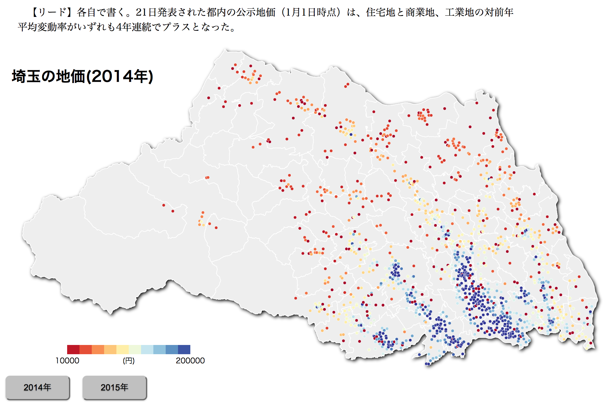
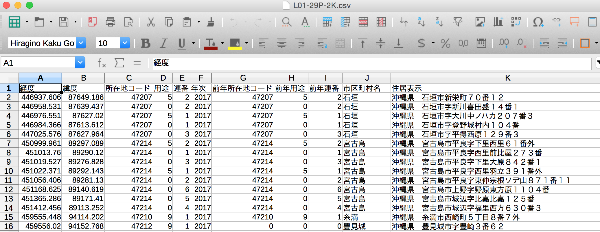

## 公示地価を分析する

公示地価を使い、初級者を対象にデータ分析を体験する。
意味あるデータを見つけ、最終的に以下のような地図＋記事を作る。

なお、地図(d3=javascript)の作り方は対象外。

### 道具

1.表計算ソフト（エクセルかLibreOffice）
2.ＱＧＩＳ
3.エディタ（Atomで可）

なお、Pythonがインストールされていること。

### 課題

1.表計算ソフトの中級（絶対参照、関数、ソート・フィルター、Lookup）
2.GISソフトの初級（何ができるソフトか理解する）

## データを入手する

国土交通省はすでに[国土交通省地価公示・都道府県地価調査](http://www.land.mlit.go.jp/landPrice/AriaServlet?MOD=0&TYP=0#)で、公示地価データの検索システムを稼働させている。つまり、個別情報を調べる機能をマスメディアが提供する意味はほとんどない。

データは[国土数値情報　ダウンロードサービス](http://nlftp.mlit.go.jp/ksj/index.html)から入手できる。

現在のデータ形式は、GML(JPGIS2.1)シェープファイルになっている。
これはxml形式（エディタで開く）とshp形式（QGISで開く）で、属性情報が入っているが、非常に読み難い。
（もし、データがこの形式しかない場合、xmlファイルからデータを抜き出す処理が必要）

幸い、旧統一フォーマット形式として、csv形式でもデータが公開されている。
最新年度とその前の年度のデータをダウンロードし、表計算ソフトでcsvファイルを見てみる。

文字化けしたら、Shift-JIS形式やUnicode(UTF8)形式などを試す。
（公的データは、ここ２、３年でShift-JISからUTF8に移行しつつある）

なお、一人当たりの県民所得は、内閣府が公開している。
データは内閣府の[国民経済計算（GDP統計）](http://www.esri.cao.go.jp/jp/sna/menu.html)から入手できる。
